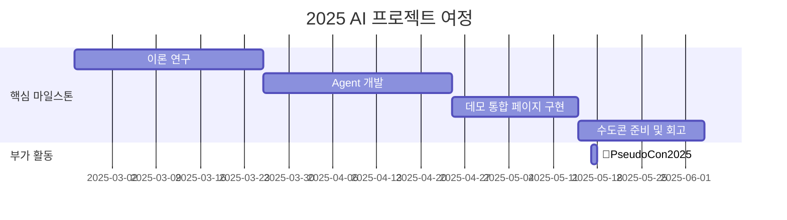

# CIA : Causal Intent Agent

[](https://pseudo-lab.com) [](https://discord.gg/EPurkHVtp2)

## 🌟 프로젝트 목표 (Project Vision)
_"Causal Intent Agent: 데이터 속 숨겨진 취향을 분석하여 개인화된 Agent 만들기"_  
- 추천시스템에서 발생하는 다양한 데이터 편향을 인과추론 기법으로 해결
- 기존 추천시스템과 함께 작동할 수 있는 모듈형 CIA 구축
- 오픈소스 프레임워크 개발로 Github 퀄리티 높이기


## 🧑 역동적인 팀 소개 (Dynamic Team)

| 역할          | 이름 |  기술 스택 배지                                                                 | 주요 관심 분야                          |
|---------------|------|-----------------------------------------------------------------------|----------------------------------------|
| **Project Manager** | 이상현 |   | 추천 시스템 / 인과추론 / Agentic AI             |
| **Member** | 앤드류 응 |   | AI                  |


## 🚀 프로젝트 로드맵 (Project Roadmap)



## 🛠️ 우리의 개발 문화 (Our Development Culture)
**우리의 개발 문화**  
```python
class CollaborationFramework:
    def __init__(self):
        self.tools = {
            'communication': 'Discord',
            'version_control': 'GitHub Projects',
            'ci/cd': 'GitHub Actions',
            'docs': 'Github Wiki'
        }
    
    def workflow(self):
        return """스터디 사이클:
        1️⃣ 근황 토크: 주간 이슈 및 뉴스 공유 
        2️⃣ 논문/개발 리뷰: 논문(1Q)/개발(2Q) 리뷰 세션 (Live Share)
        3️⃣ Todo: 계획 공유"""
```


## 📈 성과 지표 (Achievement Metrics)
**2025 주요 KPI**  
| 지표                     | 목표치 | 현재 달성률 |
|--------------------------|--------|-------------|
| 커밋 수                  | 각자 매주 1회  | 0%         |


## 💻 주차별 활동 (Activity History)

| 날짜 | 내용 | 발표자 | 
| -------- | -------- | ---- |
| 2025/02/25 |  OT      | ALL |
| 2025/03/04 |  논문 리뷰 | 상현, OO | 
| 2025/03/11 |  논문 리뷰 | OO, OO | 
| 2025/03/18 |  논문 리뷰 | OO, OO | 
| 2025/03/25 |  개발 공유 | ALL | 
| 2025/04/01 |  개발 공유 | ALL | 
| 2025/04/08 |  개발 공유 | ALL | 
| 2025/04/15 |  개발 공유 | ALL | 
| 2025/04/22 |  개발 리뷰 | ALL | 
| 2025/04/29 |  데모 병합 | ALL | 
| 2025/05/06 |  각자 개발 | ALL | 
| 2025/05/13 |  수콘 준비 | ALL | 
| 2025/05/20 |  회고 개선 | ALL |
| 2025/05/27 |  회고 개선 | ALL | 
| 2025/06/03 |  회고 개선 | ALL | 
| 2025/06/10 |  회고 개선 | ALL | 


## 💡 학습 자원 (Learning Resources)
- [Causal Recommendation Tutorial](https://causalrec.github.io/file/SIGIR23_new-causal%20recommendation_0723_all.pdf): 인과추론 추천시스템 튜토리얼 강의자료(참고용)


## 🌱 참여 안내 (How to Engage)
**팀원으로 참여하시려면 러너 모집 기간에 신청해주세요.**  
- 링크 (준비중)

**누구나 청강을 통해 모임을 참여하실 수 있습니다.**  
1. 특별한 신청 없이 정기 모임 시간에 맞추어 디스코드 #Room-?? 채널로 입장
2. Magical Week 중 행사에 참가
3. Pseudo Lab 행사에서 만나기
