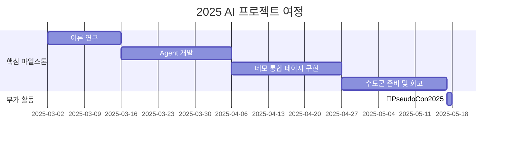

<h1 align="center"> CIA: Causal Intent Agent</h1>

<div align="center">
<a href="https://pseudo-lab.com"></a>
<a href="https://discord.gg/EPurkHVtp2"></a>
<a href="https://github.com/Pseudo-Lab/EfficientML/stargazers"></a>
<a href="https://github.com/Pseudo-Lab/EfficientML/network/members"></a>
<a href="https://github.com/Pseudo-Lab/EfficientML/pulls"></a>
<a href="https://github.com/Pseudo-Lab/EfficientML/issues"></a>
<a href="https://github.com/Pseudo-Lab/EfficientML/graphs/contributors"></a>
<a href="https://hits.seeyoufarm.com"></a>
</div>
<br>

<!-- sheilds: https://shields.io/ -->
<!-- hits badge: https://hits.seeyoufarm.com/ -->

사람들이 콘텐츠를 소비하는 이유는 다양합니다. <br/>
누군가는 단순한 재미를 위해 영상을 시청하고, 누군가는 특정 정보를 찾기 위해 검색하며, 또 다른 누군가는 트렌드를 따라가기 위해 클릭합니다. <br/>
하지만 이러한 의도(intent)는 데이터에 명확하게 기록되지 않습니다. 같은 콘텐츠를 시청했다고 해서 동일한 이유로 소비한 것은 아니기 때문입니다. <br/>

기존의 추천 및 검색 시스템은 단순한 클릭 이력과 패턴을 기반으로 작동하지만, Causal Intent Agent는 한 걸음 더 나아갑니다. <br/>
사용자의 소비 이유를 인과추론(causal inference)을 활용하여 분석함으로써, 단순한 행동 데이터가 아닌 진짜 의도를 추론합니다.<br/>
이 스터디에서는 "고객이 왜 이 콘텐츠를 선택했는가?"라는 근본적인 질문을 해결하고자 합니다. <br/>
이를 통해 추천 시스템과 검색 엔진이 단순한 과거 패턴을 따르는 것이 아니라, 사용자의 진짜 목적을 이해하고 예측하는 차세대 AI 에이전트를 개발하는 것이 목표입니다.<br/>
<div align="center">
 <br/>
</div>

## 🌟 프로젝트 목표 (Project Vision)
_"Causal Intent Agent: 데이터 속 숨겨진 취향을 분석하여 개인화된 Agent 만들기"_  
- 추천시스템에서 발생하는 다양한 데이터 편향을 인과추론 기법으로 해결
- 기존 추천시스템과 함께 작동할 수 있는 모듈형 CIA 구축
- 오픈소스 프레임워크 개발로 Github 퀄리티 높이기


## 🧑 역동적인 팀 소개 (Dynamic Team)

| 역할          | 이름 |  기술 스택 배지                                                                 | 주요 관심 분야                          | 개인페이지                          |
|---------------|------|-----------------------------------------------------------------------|----------------------------------------|----------------------------------------|
| **Project Manager** | 이상현 |   | 추천 시스템 / 인과추론 / Agentic AI             | https://www.linkedin.com/in/sanghyeon/ |
| **Member** | 김상원 |   | 개인화 추천 / 실험 설계                  |
| **Member** | 김지호 |   | 자연어처리 / RAG / 추천시스템 / LLM / Ops                | https://totravelhopefully.tistory.com/ |
| **Member** | 유경민 |   | LLM / Data Augumentation / Cross Domain | |
| **Member** | 장원혁 |   | 음성인식 / Multi-modal / LLM                | https://www.linkedin.com/in/wonhyuk-jang-44a941b4/ |
| **Member** | 정지운 |   | 통계학                  | https://www.linkedin.com/in/%EC%A7%80%EC%9A%B4-%EC%A0%95-b60725252/ |
| **Member** | 황영산 |   | 추천 시스템 / A/B test / MLOps / 마케팅                  | https://www.linkedin.com/in/yeongsan-hwang-23a10826a/ |

## 🚀 프로젝트 로드맵 (Project Roadmap)



## 🛠️ 우리의 개발 문화 (Our Development Culture)
**우리의 개발 문화**  
```python
class CollaborationFramework:
    def __init__(self):
        self.tools = {
            'communication': 'Discord',
            'version_control': 'GitHub Projects',
            'ci/cd': 'GitHub Actions',
            'docs': 'Github Wiki'
        }
    
    def workflow(self):
        return """스터디 사이클:
        1️⃣ 근황 토크: 주간 이슈 및 뉴스 공유 
        2️⃣ 논문/개발 리뷰: 논문(1Q)/개발(2Q) 리뷰 세션 (Live Share)
        3️⃣ Todo: 계획 공유"""
```


## 📈 성과 지표 (Achievement Metrics)
**2025 주요 KPI** (TBD) 
| 지표                     | 목표치 | 현재 달성률 |
|--------------------------|--------|-------------|
| 커밋 수                  | 각자 매주 1회  | 0%         |


## 💻 주차별 활동 (Activity History)

| 날짜 | 내용 | 발표자 | 
| -------- | -------- | ---- |
| 2025/03/04 |  OT      | ALL, 상현 | 
| 2025/03/11 |  논문 리뷰 | 상현님, 상원님 | 
| 2025/03/18 |  논문 리뷰 | 지운님, 영상님 | 
| 2025/03/25 |  논문 리뷰 | 원혁님, 경민님, 지호님 | 
| 2025/04/01 |  개발 진행 사항 공유 | ALL | 
| 2025/04/08 |  개발 진행 사항 공유 | ALL | 
| 2025/04/15 |  개발 진행 사항 공유 | ALL | 
| 2025/04/22 |  개발 리뷰 | ALL | 
| 2025/04/29 |  데모 병합 | ALL | 
| 2025/05/06 |  모같코    | ALL | 
| 2025/05/13 |  수콘 준비 | ALL | 
| 2025/05/20 |  회고 및 개선 | ALL |
| 2025/05/27 |  회고 및 개선 | ALL | 
| 2025/06/03 |  회고 및 개선 | ALL | 
| 2025/06/10 |  회고 및 개선 | ALL | 


## 💡 학습 자원 (Learning Resources)
- [Practical Implementation of Causal Inference for Advancing Recommender Systems](https://docs.google.com/presentation/d/1Bbyyf1NYXFzzGVr-jKNdWelkLDmT2LgQhbK32_5f9JI/edit?usp=sharing): 인과추론 학회 발표자료
- [Causal Recommendation Tutorial](https://causalrec.github.io/file/SIGIR23_new-causal%20recommendation_0723_all.pdf): 인과추론 추천시스템 튜토리얼 강의자료(참고용)
- Discussion 주차별 댓글에 발표자료 업로드 중


## 🌱 참여 안내 (How to Engage)
### 지원 시 유의사항
- 러너 신청 기간: **2/19-3/1**
- **3/2에 러너 발표 예정이므로, 해당 날짜에 이메일(스팸 게시판 포함)과 Discord를 꼭 확인해 카톡방에 입장해, 3/4의 첫 모임에 지장이 가지 않도록 해야 함**

### 시간
- 온라인: Room-DH, 매주 화요일 오후 9시
- 일부 주간은 오프라인(강남) 모임 예정, 화요일 저녁
- **첫 모임(3/4)은 오프라인 진행, 오후 7시 예정**

### 러너 모집
- **추천/검색 시스템 개발 경험이 있으신 분 (추천/검색 시스템에 필요한 인과추론을 공부하는 스터디입니다!)**
- **인과추론 분야에 대한 필요성을 공감하시는 분**
- **2개월 내에 agent를 만들어보고 싶으신 분**


**누구나 청강을 통해 모임을 참여하실 수 있습니다.**  
1. 특별한 신청 없이 정기 모임 시간에 맞추어 디스코드 #Room-?? 채널로 입장
2. Magical Week 중 행사에 참가
3. Pseudo Lab 행사에서 만나기
